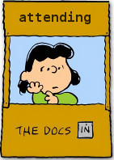

# attending: the docs in!

Better docstrings with an impeccable bedside manner.

A python package which brings better docstrings with an impeccable bedside manner.

The `attending` supervises other docs, and has the last word.

## Improving the quality of resident docs.

Batteries included, instruction may be not...

The Python standard library is full of batteries.

The CPython community, which develops reference implementation of the
language, prefers the cross-referencing and coherent standalone documentation
provided by 
[docs.python.org](https://docs.python.org)

The job of the `attending` is to make more documentation available directly in
the REPL.

One of the more ambitious goals of this project is a "No docstring left
as None" policy. A docstring of None is a bug in the standard library.

It's a joy to have usage examples in the docstring of a function. In the
scientific Python community, that is a standard.

Guido van Rossum was [asked this question directly at the first PyData
workshop in 2012](https://youtu.be/QjXJLVINsSA?t=4757), and replied

the importance of docstrings:

web editor to contribute docstrings
most work that you 

help/search that indexes this

"you're proposing an inordinate amount of work here...
because we have very good documentation that was very intentionally written
OUT of line, not as part of the docstrings, so you've much more freedom to
sort of, emphasize things, group things, show examples that cross multiple 

## How do you keep the `attending` docs up-to-date?

`attending` was written with community participation in mind.

ela.pid.life - some fangs for your python!

## What about incompatible changes across versions?

## Is it possible to end up with docs that don't match the implementation?

In this respect, `attending` docs are no different from the regular docs. They
may fall out of sync as libraries change. 

[ ] doctest the new docs strings?

## What about different versions of the language?

## Why's it called `attending`?

<dl>
<dt>attending physician:</dt>
<dd>the physician who is responsible for a particular patient. In a university
hospital setting, an attending physician often also has teaching
responsibilities, holds a faculty appointment, and supervises residents and
medical students. Also called `attending`.</dd>
Mosby's Medical Dictionary
</dl>

The `attending` supervises other docs...  and has the last word.
